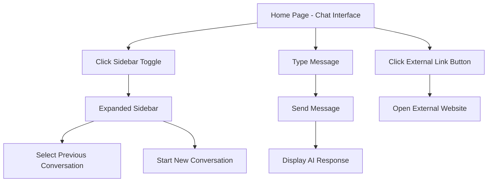

## 1. Product Overview
Aplicação web que simula a interface do ChatGPT com foco em experiência de usuário moderna e intuitiva. O produto permite interações conversacionais com barra lateral navegacional que inicia recolhida e pode ser expandida, além de integração com links externos através de botão no cabeçalho.

Ideal para demonstrações, protótipos de interfaces de IA conversacional ou como base para desenvolvimento de assistentes virtuais personalizados.

## 2. Core Features

### 2.1 User Roles
| Role | Registration Method | Core Permissions |
|------|---------------------|------------------|
| Visitor User | No registration required | Can interact with chat interface, view conversation history during session |

### 2.2 Feature Module
A aplicação consiste nos seguintes componentes principais:
1. **Interface de Chat**: área principal de conversação com histórico de mensagens e input de texto
2. **Menu Lateral**: navegação que inicia recolhida e expande ao clicar, contendo opções de conversas
3. **Cabeçalho**: barra superior com título e botão de link externo

### 2.3 Page Details
| Page Name | Module Name | Feature description |
|-----------|-------------|---------------------|
| Chat Interface | Message Display Area | Show conversation history with user messages aligned right and AI responses aligned left with distinct styling |
| Chat Interface | Message Input | Provide text input field with send button, support for multiline text and keyboard shortcuts |
| Chat Interface | Typing Indicator | Display animated indicator when AI is processing response |
| Sidebar Navigation | Collapsible Menu | Start collapsed showing only icons, expand to full width on click revealing conversation history and new chat option |
| Sidebar Navigation | Conversation List | Show list of previous conversations with timestamps and preview text |
| Header Bar | External Link Button | Display button in top-right corner that opens external website in new tab |
| Header Bar | Application Title | Show centered title identifying the application |

## 3. Core Process
O fluxo principal começa com o usuário acessando a aplicação e vendo a interface de chat com o menu lateral recolhido. O usuário pode clicar no ícone do menu lateral para expandir e ver o histórico de conversas, ou começar uma nova conversa diretamente. Durante a conversa, mensagens aparecem no histórico com distinção visual entre perguntas e respostas. O botão de link externo no canto superior direito permite acesso rápido a recursos adicionais.

## 4. User Interface Design

### 4.1 Design Style
- **Primary Colors**: Fundo escuro (#343541) para área de chat, cinza claro para mensagens do usuário, branco para mensagens da IA
- **Secondary Colors**: Verde (#10A37F) para botões de ação, bordas sutis em tons de cinza
- **Button Style**: Bordas arredondadas (8px radius), efeitos hover sutis, ícones minimalistas
- **Typography**: Fonte sans-serif moderna (Inter ou similar), tamanhos: 14px para mensagens, 16px para títulos
- **Layout Style**: Layout de duas colunas com sidebar collapsível, design limpo e minimalista
- **Icons**: Ícones de linha fina (outline) para consistência visual

### 4.2 Page Design Overview
| Page Name | Module Name | UI Elements |
|-----------|-------------|-------------|
| Chat Interface | Message Area | Container com scroll automático, altura dinâmica, bordas arredondadas nas mensagens, espaçamento consistente |
| Chat Interface | Input Section | Barra fixa na parte inferior com campo de texto expansível, botão de envio com ícone de avião de papel |
| Sidebar | Collapsible Panel | Largura de 60px quando recolhida, 300px quando expandida, transição suave de 300ms, sombra sutil |
| Header | Top Bar | Altura de 60px, fundo semi-transparente, botão de link externo com ícone de link/externo, alinhado à direita |

### 4.3 Responsiveness
Aplicação desenvolvida com abordagem desktop-first, adaptável para tablets e dispositivos móveis. Em telas menores que 768px, o sidebar ocupa a tela toda quando expandido e o layout de chat se reorganiza para melhor aproveitamento do espaço vertical. Touch interactions otimizados para dispositivos móveis com áreas de toque ampliadas.