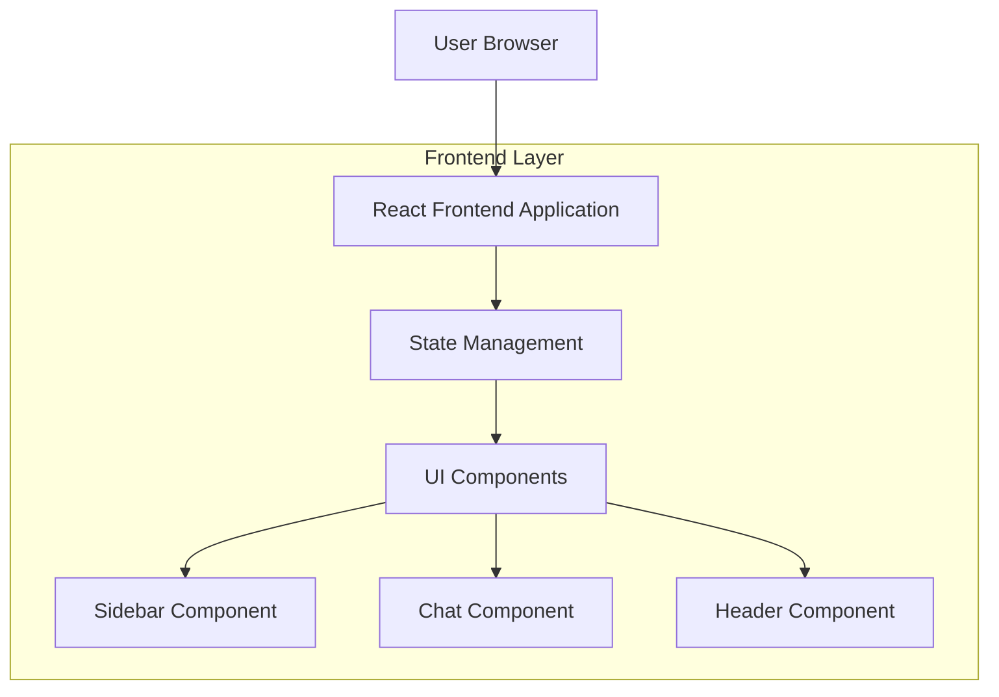

## 1. Architecture design



## 2. Technology Description
- Frontend: React@18 + tailwindcss@3 + vite
- Initialization Tool: vite-init
- Backend: None (aplicação frontend apenas)
- Additional Libraries: lucide-react (ícones), framer-motion (animações)

## 3. Route definitions
| Route | Purpose |
|-------|---------|
| / | Página principal com interface de chat completa |
| /chat | Rota alternativa para a interface de chat |

## 4. Component Architecture

### 4.1 Core Components

**Sidebar Component**
```typescript
interface SidebarProps {
  isCollapsed: boolean;
  onToggle: () => void;
  conversations: Conversation[];
  onConversationSelect: (id: string) => void;
}
```

**Chat Component**
```typescript
interface ChatProps {
  messages: Message[];
  onSendMessage: (message: string) => void;
  isTyping: boolean;
}

interface Message {
  id: string;
  content: string;
  sender: 'user' | 'ai';
  timestamp: Date;
}
```

**Header Component**
```typescript
interface HeaderProps {
  externalLink: string;
  externalLinkText: string;
}
```

### 4.2 State Management
```typescript
interface AppState {
  sidebarCollapsed: boolean;
  currentConversation: Conversation | null;
  conversations: Conversation[];
  messages: Message[];
  isTyping: boolean;
}
```

### 4.3 Mock Data Structure
```typescript
const mockConversations: Conversation[] = [
  {
    id: '1',
    title: 'Nova Conversa',
    lastMessage: 'Olá, como posso ajudar?',
    timestamp: new Date(),
    messageCount: 2
  }
];

const mockMessages: Message[] = [
  {
    id: '1',
    content: 'Olá!',
    sender: 'user',
    timestamp: new Date()
  },
  {
    id: '2',
    content: 'Olá! Como posso ajudar você hoje?',
    sender: 'ai',
    timestamp: new Date()
  }
];
```

## 5. Styling Architecture

### 5.1 Tailwind Configuration
```javascript
// tailwind.config.js
module.exports = {
  theme: {
    extend: {
      colors: {
        'chat-dark': '#343541',
        'chat-gray': '#40414f',
        'chat-user': '#343541',
        'chat-ai': '#444654',
        'chat-accent': '#10A37F'
      },
      animation: {
        'fade-in': 'fadeIn 0.3s ease-in-out',
        'slide-in': 'slideIn 0.3s ease-out'
      }
    }
  }
}
```

### 5.2 Responsive Breakpoints
- Mobile: < 768px
- Tablet: 768px - 1024px
- Desktop: > 1024px

## 6. Performance Considerations
- Implementar virtualização para listas longas de mensagens
- Usar React.memo para otimizar re-renders de componentes
- Lazy loading para componentes não-críticos
- Implementar debounce para input de texto

## 7. Accessibility Features
- Suporte para navegação por teclado
- ARIA labels para elementos interativos
- Alto contraste para melhor legibilidade
- Tamanhos de fonte responsivos